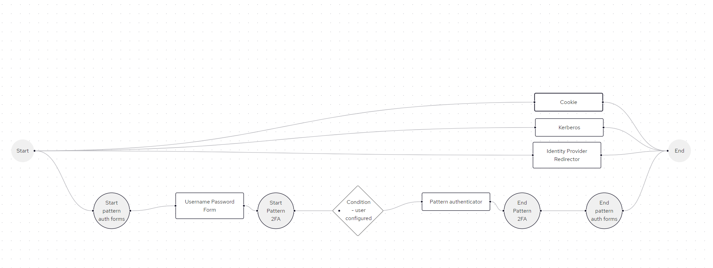
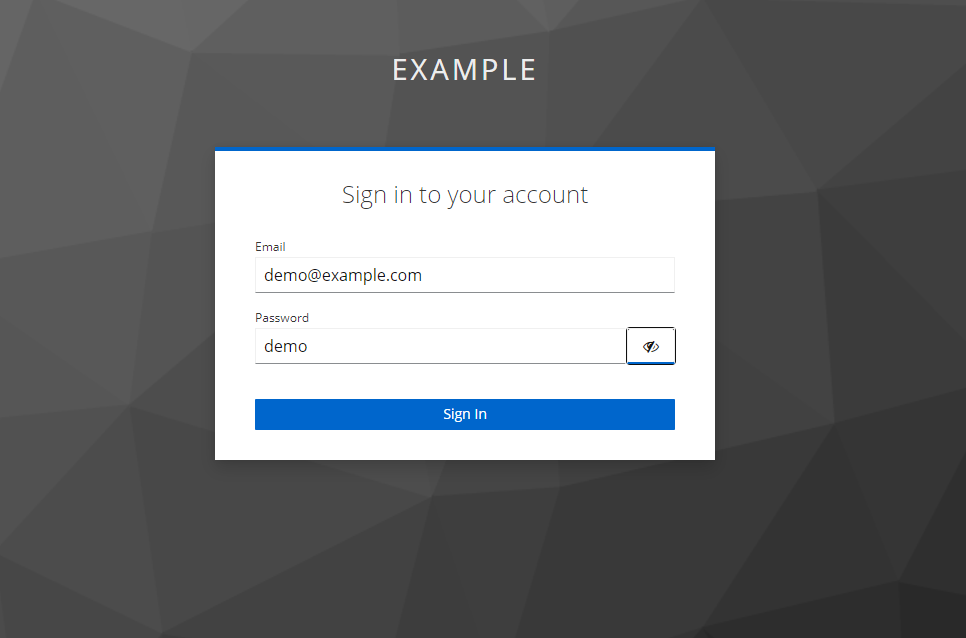
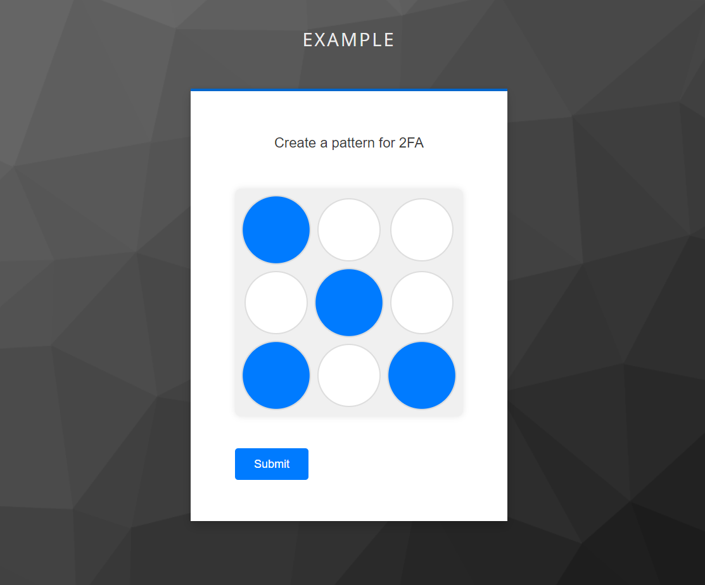
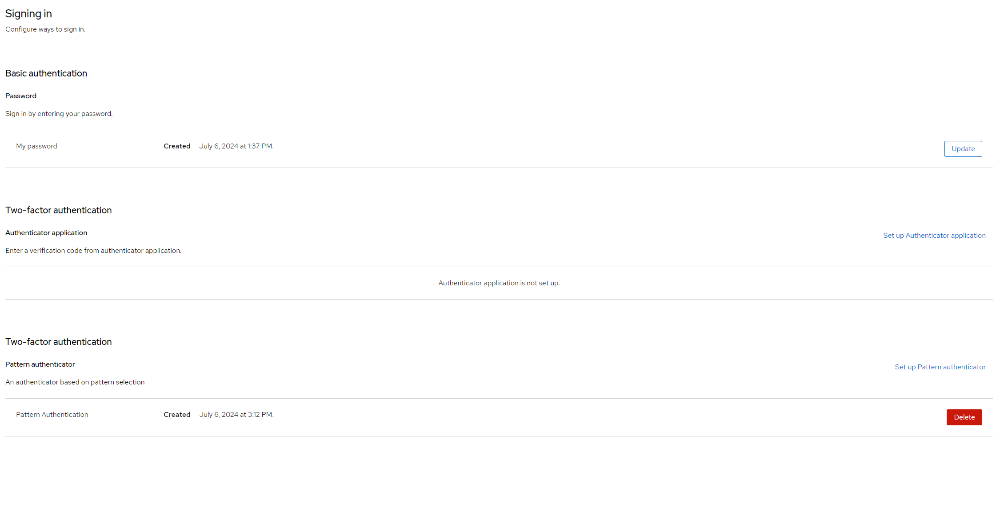
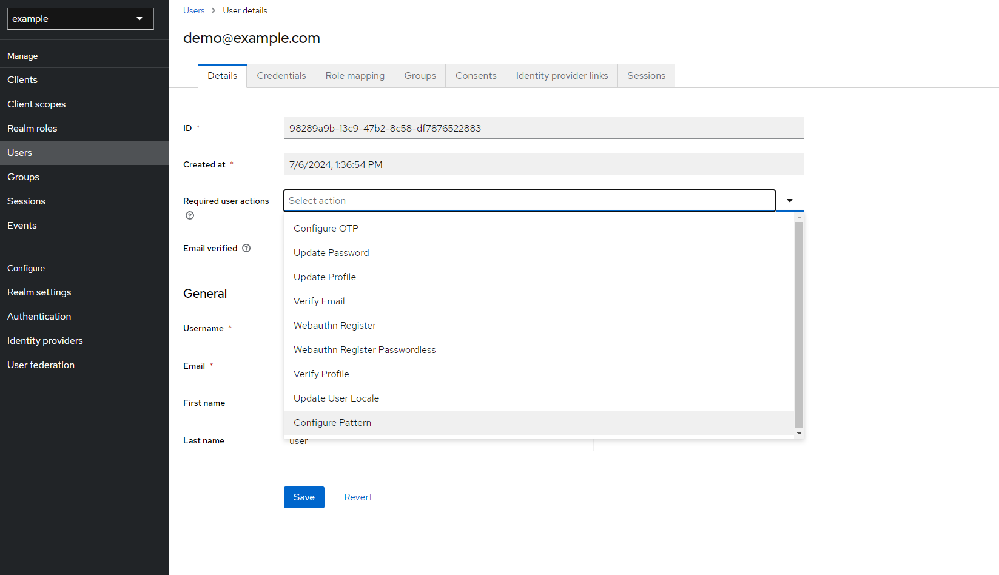
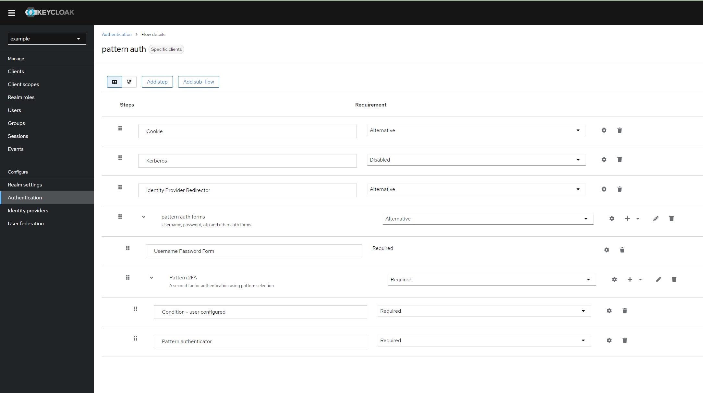
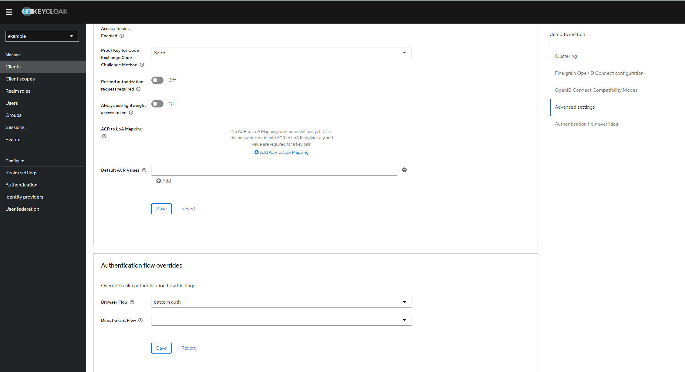

# Full Stack Ecommerce Project


## Table of Contents

- [Description](#description)
- [Features](#features)
- [Deployment](#deployment)
- [Usage](#usage)
- [Testing the Flow](#testing-the-flow)
- [Authentication Flow](#authentication-flow)
- [Security Considerations](#security-considerations)
- [Appendix](#appendix)

## Description

This project provides a method for creating a custom authentication flow, utilizing an authentication, credential, and required action providers. 

## Features

- **Two-Factor Authentication (2FA):** Adds a second factor authentication using an SPI.
- **Credential Providers:** Implementation of a custom credential provider.
- **Authentication Providers:** Implementation of a custom authentication provider.
- **Required Action Providers:** Implementation of a custom required action provider.
- **Pattern Credential:** Creates a new credential type, a simple pattern, for the sake of the example.


## Deployment
To package the sources, build the image, and deploy the services:
````sh
./start.sh
````
This will also copy a preconfigured realm with a custom authentication flow utilizing all the providers created.

## Testing the Flow

- **Preconfigured Realm:** An already configured realm is copied into the image. You can view the configurations in the Keycloak Admin Console and authenticate using:
  - **Username:** `admin`
  - **Password:** `admin`.
- **Preconfigured User:** To test the flow, go to [http://localhost:8080/realms/example/account](http://localhost:8080/realms/example/account) and authenticate using:
    - **Username:** `demo@example.com`
    - **Password:** `demo`
    - **2FA Setup:** As part of the realm configuration, the 2FA flow is already configured and is used by the account-console client. Therefore, as part of your first login, you will have to set up the 2FA.

## Authentication Flow
The below browser flow has been created. The flow has 3 alternatives. The last alternative is the one configured to use the authentication SPI for the 2FA after normal login. The account-console client browser flow was overriden to use it. As part of the implementation of the authentication SPI, it is adding a required action using the implemented provider for the user to complete. The required action is creating the credential that was implemented using the credential provider.



## Security Considerations

  - Ensure that all alternative flows align with your security needs. For example, a user may go through 2FA whenever he is redirected by client X that is using your custom browser flow. However, if that same user was being redirected by another client Y that is not using your custom browser flow, then the user will not go through the steps in your custom flow.
  - Consider adding an implementation of PasswordPolicyProvider if your credential provider is using a new type of password-like credential. Have a look at the built-in implementations of PasswordPolicyProvider.
  - In a real scenario, hash any secret data before persisting. For simplicity, the credentials are not hashed when stored in this example.

## Appendix

### User First Login





### Admin






